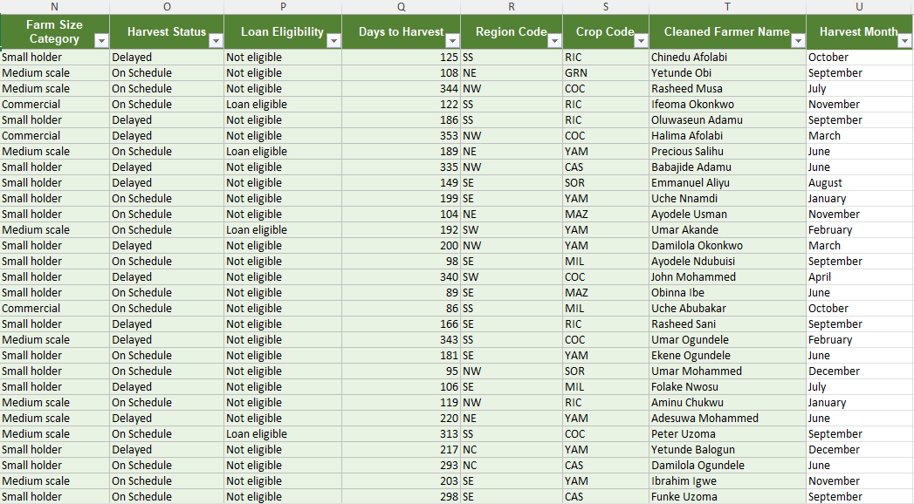

# Agritech Supply Chain & Yield Analysis
## Project Overview
This repository contains a processed and engineered agricultural dataset evaluating 200 farmer records. The goal of this project was to transform raw farm records, engineer operational feature column, and extract core business metrics to optimize supply chain timelines and financial risk assessments.

# Business value and Operational Impact
By transforming this raw agricultural raw data, this project unlocks three critical business capacities:
1. **Risk Management:** Instantly flags delayed harvest to protect downstream supply chain timelines.
2. **Financial Underwriting:** Standardizes credit scoring criteria to automate loan approvals for eligible cooperative farmers.
3. **Data Integrity:** Cleans messy input text to prevent duplicate records and downstream data warehouse reporting errors.

## Processed Data Preview

## Repository Structure
* [agritech_farm_data.xlsx]:  The primary processed excel workbook containing engineered feature columns.
* [README.md] :Project documentation, business logic and execcutive insights.
---
## Data Engineering & Feature Columns
The followings were programmatically engineered using Excel formulars to enhance the raw dataset:

* **Farm Size Classification ("Column N"):** Categorized landholdings into *Smallholder* , *Medium-Scale* , or *Commercial* using nested statements.
* **Harvest Schedule Flag ("Column O"):** Evaluated operational timelines against target dates to flag distribution delays.
* **Loan Eligibility Status ("Column P"):** Combined conditional evaluations("AND") checking for strong repayment history and sustainable land sizes( 2 hectares).
* **Days to Harvest ("Column Q"):** Subtracted planting timelines from harvest dates to isolate crop growth durations.
* **Metadata Extraction ("Column R & S"):** Used text manipulation ("LEFT" and "MID") to cleanly isolate region and crop codes embedded within FarmerIDs.
* **Data Hygiene Scrubber ("Column T"):** Utilized text trimming functions to permanently eliminate irregular and messy whitespaces.
-----

## Executive Insights & Key Metrics

### Key Date Metrics
* **Cooperative Registration Window:** Earliest registration:**04/01/2023** | Most recent registration : **19/06/2025**.
* **Peak Operational Window:** **June** recorded the highest operational volume with a total of **24 harvests**.

### Yield & Financial Summary
| Metric Description | Calculated Value | Analytics Function Used |
| :--- | :--- | :--- | 
| **Total Quantity Harvested (Maize)** | 2,947,880 kg | 'SUMIF' |
| **Average Quantity Harvested** | 368,485 kg | 'AVERAGEIF' |
| **Peak Single-Farm Yield** | 889,900 kg | 'MAXIFS |
| **Minimum Single-Farm Yield** | 74, 560 kg | 'MINIFS |
| **Total Loan Volume Disbursed** | 4,456,00 kg | 'SUMIF'| 

### Regional Farmer Distribution
* **North Central (NC):** 22 Farmers
* **North East (NE):** 27 Farmers
* **North West (NW):** 41 Farmers
* **South East (SE):** 43 Farmers
* **South West(SW):** 36 Farmers

----
##**Let's Connect!**
Thank you for exploring my project. I am actively building my portfolio in Data Analytics.
* **LinkedIn:** [Precious Emoh] (www.linkedin.com/in/precious-emoh)
* **Email:** emohbeloved@gmail.com
